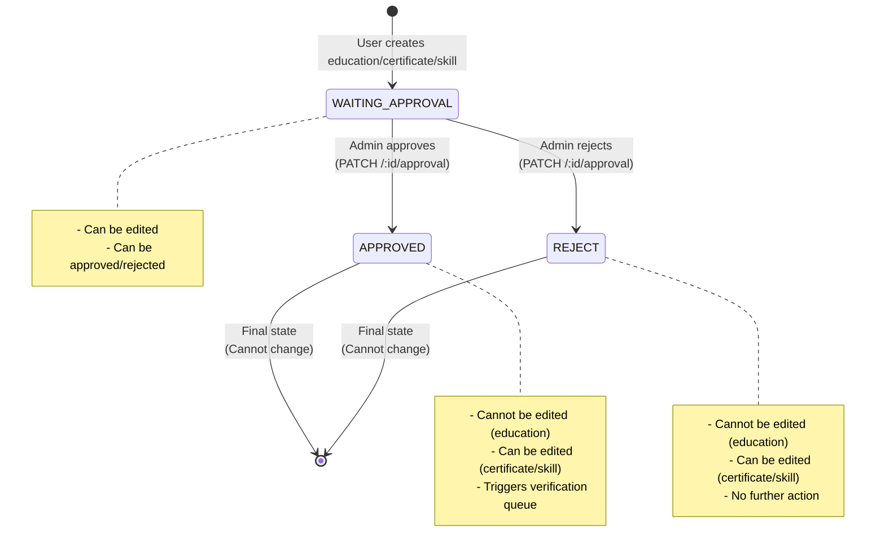

# Approval State Transition Flow

**State diagram showing approval state transitions**

## Description

This diagram shows the approval state system used for user_educations, user_certificates, and user_skills. It illustrates how states transition and what actions are allowed in each state.

## State Diagram

## State Descriptions

### WAITING_APPROVAL
- **Initial state** when user creates education/certificate/skill
- **Can be edited** by user
- **Can transition to:** APPROVED or REJECT (via admin approval)
- **Cannot transition from:** APPROVED or REJECT (final states)

### APPROVED
- **Final state** - cannot be changed once set
- **Edit restrictions:**
  - Education: Cannot be edited
  - Certificate: Can be edited
  - Skill: Can be edited
- **Triggers:** Verification queue (education → license, certificate → skill)
- **Cannot transition to:** Any other state

### REJECT
- **Final state** - cannot be changed once set
- **Edit restrictions:**
  - Education: Cannot be edited
  - Certificate: Can be edited
  - Skill: Can be edited
- **No further action:** No queue processing, no automatic grants
- **Cannot transition to:** Any other state

## Key Points

- Only WAITING_APPROVAL can transition to APPROVED or REJECT
- APPROVED and REJECT are final states (immutable)
- Education has stricter edit restrictions than certificate/skill
- APPROVED state triggers background queue processing for automatic grants
- REJECT state does not trigger any processing
- FE/mobile should display verification using `is_verified`; `approval_state` is for the approval workflow only

