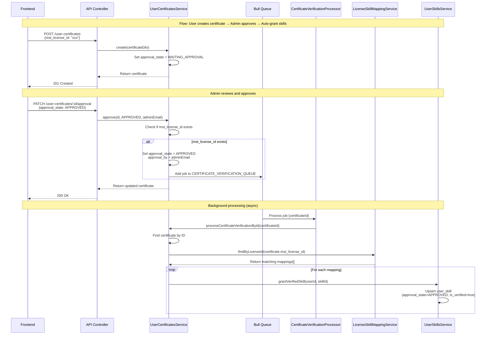

# Certificate Approval & Verification Flow

**Flow:** User creates certificate → Admin approves → Auto-grant skills

## Description

This flow shows how a user creates a certificate record, admin approves it, and the system automatically grants skills based on license-skill mappings.

## Sequence Diagram

## Key Points

- Certificate is created with `approval_state = WAITING_APPROVAL` by default
- Admin must explicitly approve via `PATCH /user-certificates/:id/approval`
- Queue is only triggered if `mst_license_id` exists on the certificate
- Approval triggers async queue processing (non-blocking)
- System finds matching license-skill mappings based on certificate's `mst_license_id`
- For each matching mapping, a skill is automatically granted with `approval_state = APPROVED` and `is_verified = true`; FE/mobile should rely on `is_verified` for showing verified status

