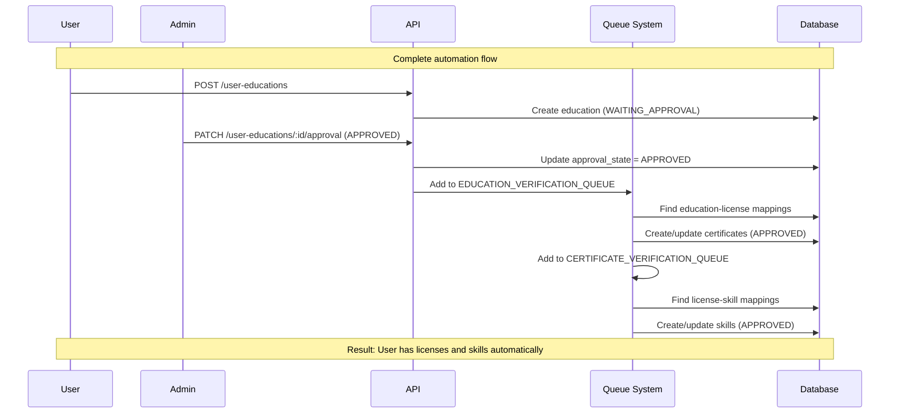

# Complete End-to-End Flow (Education → Certificate → Skill)

**Complete automation flow from education to skills**

## Description

This diagram provides a high-level overview of the complete automation flow, showing how a user's education leads to automatic certificate and skill granting through the entire system.

## Sequence Diagram

## Flow Steps

1. **User creates education**
   - User submits education via `POST /user-educations`
   - Education is created with `approval_state = WAITING_APPROVAL`

2. **Admin approves education**
   - Admin approves via `PATCH /user-educations/:id/approval`
   - Education state changes to `APPROVED`
   - Education verification queue job is added

3. **System grants licenses (async)**
   - Queue processor finds matching education-license mappings
   - For each mapping, creates/updates certificate with `approval_state = APPROVED` and `is_verified = true` (FE/mobile should read `is_verified` for verified status)
   - Certificate verification queue job is added for each new certificate

4. **System grants skills (async)**
   - Queue processor finds matching license-skill mappings
   - For each mapping, creates/updates skill with `approval_state = APPROVED` and `is_verified = true`

## Key Points

- All processing is **asynchronous** (non-blocking)
- User and admin get immediate responses
- Background queues handle all automatic granting
- Multiple licenses can be granted from one education
- Multiple skills can be granted from one certificate
- Complete automation: Education → License → Skill
- No manual intervention needed after admin approval

## Related Flows

- See [Education Approval & Verification Flow](./education-approval-verification-flow.md) for detailed education flow
- See [Certificate Approval & Verification Flow](./certificate-approval-verification-flow.md) for detailed certificate flow
- See [Approval State Transition Flow](./approval-state-transition-flow.md) for state management details

