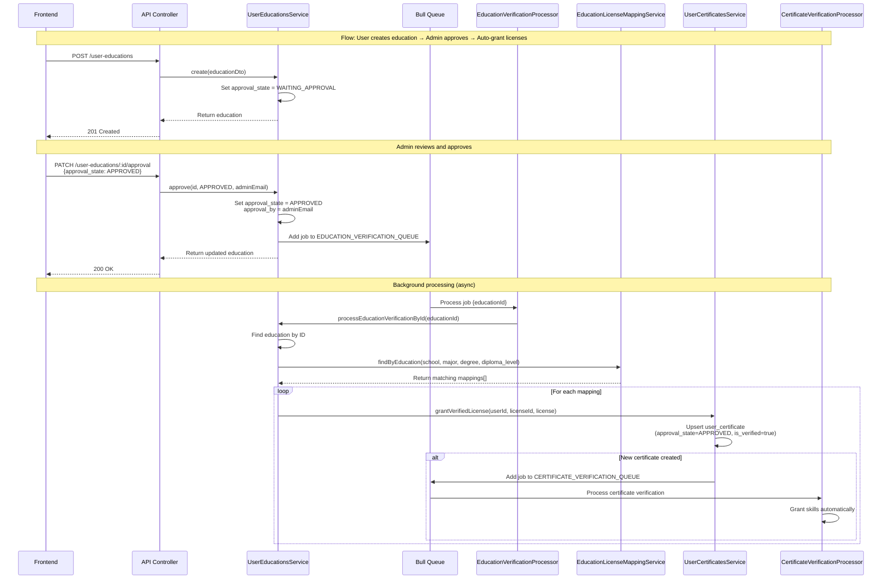

# Education Approval & Verification Flow

**Flow:** User creates education → Admin approves → Auto-grant licenses → Auto-grant skills

## Description

This flow shows how a user creates an education record, admin approves it, and the system automatically grants licenses (and subsequently skills) based on education-license mappings.

## Sequence Diagram

## Key Points

- Education is created with `approval_state = WAITING_APPROVAL` by default
- Admin must explicitly approve via `PATCH /user-educations/:id/approval`
- Approval triggers async queue processing (non-blocking)
- System finds matching education-license mappings based on: school, major, degree, diploma_level
- For each matching mapping, a certificate is automatically granted
- New certificates trigger certificate verification queue, which grants skills automatically
- FE/mobile should read verification from `is_verified` fields (certificates/skills), not from `approval_state`

