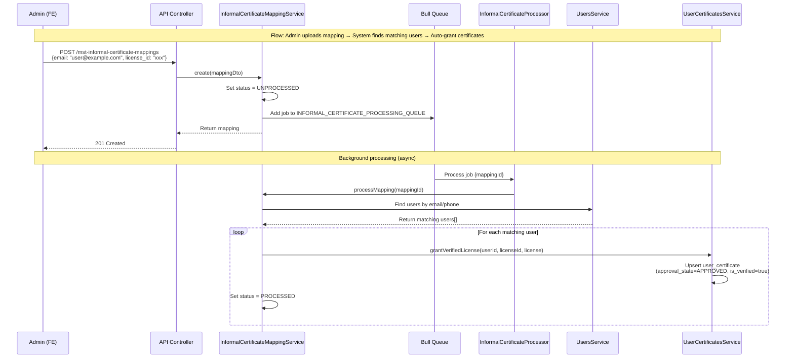

# Informal Certificate Processing Flow

**Flow:** Admin uploads mapping → System finds matching users → Auto-grant certificates

## Description

This flow shows how an admin creates an informal certificate mapping (email/phone to license), and the system automatically finds matching users and grants certificates to them.

## Sequence Diagram

## Key Points

- Mapping is created with `status = UNPROCESSED` by default
- Queue processing is triggered immediately upon creation
- System searches for users matching the email or phone in the mapping
- Multiple users can match (if they share the same email/phone)
- For each matching user, a certificate is automatically granted with `approval_state = APPROVED` and `is_verified = true` (FE/mobile should read `is_verified` for verified status)
- Mapping status is updated to `PROCESSED` after successful processing
- If no users match, mapping remains `UNPROCESSED` (will be processed when user registers/updates)

