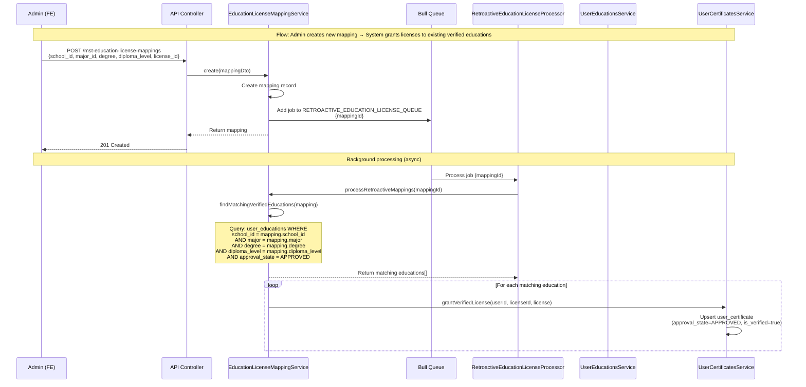

# Retroactive Processing Flow (New Mapping Created)

**Flow:** Admin creates new mapping → System grants licenses to existing verified educations

## Description

This flow shows how when an admin creates a new education-license mapping, the system retroactively grants licenses to all existing verified educations that match the mapping criteria.

## Sequence Diagram

## Key Points

- Triggered when admin creates new education-license mapping via `POST /mst-education-license-mappings`
- Also triggered when mapping is updated (if criteria changed) via `PUT /mst-education-license-mappings/:id`
- Queue processing is async (non-blocking)
- System searches for existing verified educations (`is_verified = true`, which is set when approval_state = APPROVED) that match the mapping criteria
- Matching criteria: school_id, major, degree, diploma_level
- For each matching education, a certificate is automatically granted
- This ensures existing users benefit from new mappings without manual intervention
- Similar flow exists for license-skill mappings (retroactive skill granting)

