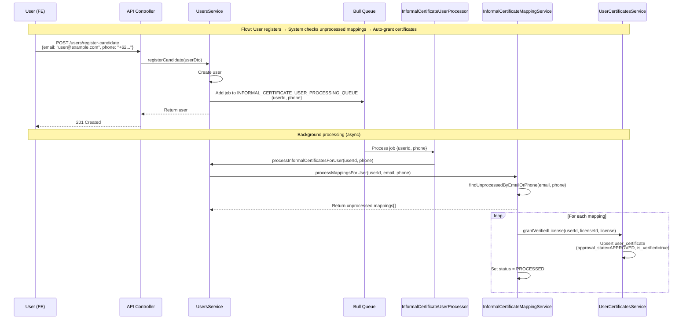

# User Registration Triggers Informal Certificate Flow

**Flow:** User registers → System checks unprocessed mappings → Auto-grant certificates

## Description

This flow shows how when a user registers (or updates email/phone), the system automatically checks for unprocessed informal certificate mappings and grants certificates if matches are found.

## Sequence Diagram

## Key Points

- Triggered when user registers via `POST /users/register-candidate`
- Also triggered when user updates email/phone via `PUT /users/:id`
- Queue processing is async (non-blocking)
- System searches for unprocessed mappings matching the user's email or phone
- For each matching mapping, a certificate is automatically granted
- Mapping status is updated to `PROCESSED` after successful processing
- This ensures users get certificates even if they registered before the mapping was created

